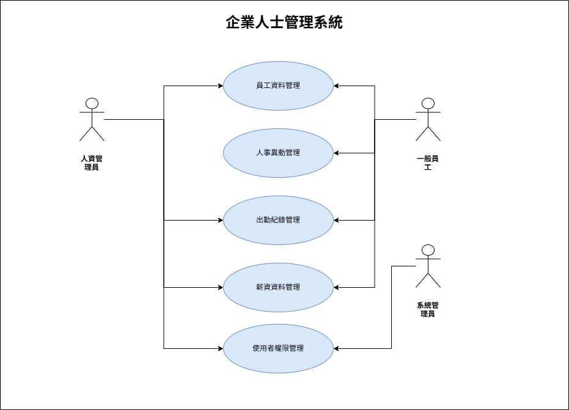

# 企業人事管理系統
**114 軟體工程期末報告**  
授課老師：葉芳銘

---

## 一、需求說明書（SRS）

### 1.1 系統目的
本系統旨在建置一套完整且具延展性之企業人事管理系統，協助企業在員工資料、人事流程與行政管理上進行系統化管理。透過資訊系統取代傳統紙本或人工處理方式，可有效降低人為錯誤、提升資料一致性，並縮短人事作業流程時間，使企業能更專注於核心業務發展。

### 1.2 使用者角色
- **人資管理員**：負責員工資料管理、人事異動與薪資管理。  
- **一般員工**：可查詢及維護個人基本資料、出勤及薪資資訊。  
- **系統管理員**：管理帳號與權限，進行系統維護。  

### 1.3 功能需求
- 員工基本資料管理  
- 人事異動管理  
- 出勤紀錄管理  
- 薪資資料管理  
- 使用者登入與權限控管  

### 1.4 非功能需求
- 系統效能：操作回應時間 < 3 秒  
- 系統安全性：帳號驗證與權限控管  
- 系統可用性：直覺化介面  
- 系統可維護性：模組化設計，方便擴充  

### 1.5 UML（Use Case Diagram）
顯示各角色與系統功能之互動關係：

---

## 二、概要設計說明書（HLD）

### 2.1 系統架構
採三層式架構：
- **表現層**：提供使用者介面  
- **應用層**：處理業務邏輯  
- **資料層**：資料儲存與存取  

### 2.2 模組劃分
- 使用者管理模組  
- 員工資料管理模組  
- 出勤管理模組  
- 薪資管理模組  

### 2.3 系統流程概述
顯示使用者操作流程與資料庫互動：

---

## 三、詳細設計說明書（LLD）

### 3.1 模組功能說明
- **使用者管理模組**：登入驗證與權限控管  
- **員工資料模組**：員工資料新增、修改、查詢  
- **出勤管理模組**：記錄員工上下班，提供查詢與統計  
- **薪資管理模組**：管理薪資資料，提供查詢  

### 3.2 核心流程示例
新增員工資料流程：
1. 人資管理員輸入資料  
2. 系統驗證資料完整性  
3. 寫入資料庫  
4. 回傳成功或失敗訊息  

### 3.3 UML（Class Diagram）
顯示類別結構及關聯：

---

## 四、測試計畫

### 4.1 測試目標
確保系統功能正確、資料處理穩定，符合使用者需求。

### 4.2 測試類型
- 單元測試  
- 整合測試  
- 系統測試  

### 4.3 測試案例
- 驗證使用者登入功能  
- 新增、修改員工資料  
- 出勤紀錄顯示正確  

### 4.4 Sequence Diagram（新增員工資料）
顯示新增員工資料流程中模組訊息互動：

---
## 五、結論
本文件說明企業人事管理系統之整體設計思路，透過軟體工程方法進行需求分析、系統設計與測試規劃，作為系統開發與實施之依據。

## 五、結論
本文件說明企業人事管理系統之整體設計思路，透過軟體工程方法進行需求分析、系統設計與測試規劃，作為系統開發與實施之依據。
