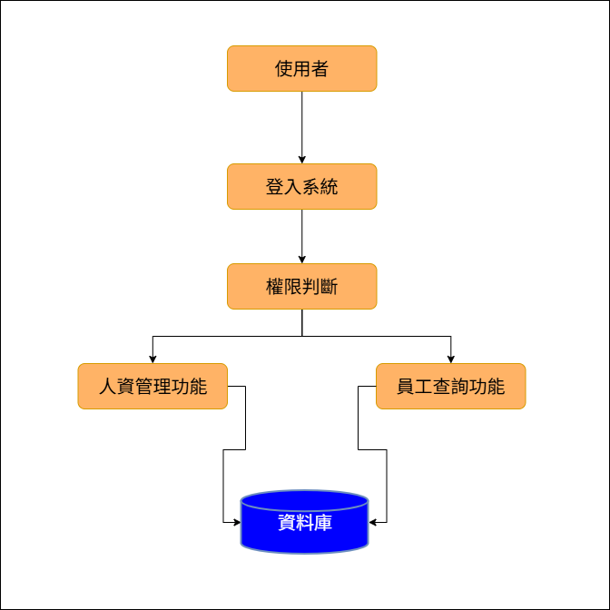

# 企業人事管理系統
**114 學年度 軟體工程期末報告**  

組員：  
- 11224218 楊林熹  
- 11224219 黃心呈  

授課老師：葉芳銘  

---

## 目錄
1. [需求說明書（SRS）](#一需求說明書srs)
    - [1.1 系統目的](#11-系統目的)
    - [1.2 使用者角色](#12-使用者角色)
    - [1.3 功能需求](#13-功能需求)
    - [1.4 非功能需求](#14-非功能需求)
    - [1.5 UML（Use Case Diagram）](#15-umluse-case-diagram)
2. [概要設計說明書（HLD）](#二概要設計說明書hld)
    - [2.1 系統架構（豐富版）](#21-系統架構豐富版)
    - [2.2 模組劃分](#22-模組劃分)
    - [2.3 系統流程概述](#23-系統流程概述)
    - [2.4 設計原則與假設條件](#24-設計原則與假設條件)
3. [詳細設計說明書（LLD）](#三詳細設計說明書lld)
    - [3.1 模組功能說明](#31-模組功能說明)
    - [3.2 核心流程示例（新增員工資料）](#32-核心流程示例新增員工資料)
    - [3.3 UML（Class Diagram）](#33-umlclass-diagram)
    - [3.4 系統擴充與未來發展方向](#34-系統擴充與未來發展方向)
4. [測試計畫](#四測試計畫)
    - [4.1 測試目標](#41-測試目標)
    - [4.2 測試類型](#42-測試類型)
    - [4.3 測試案例](#43-測試案例)
    - [4.4 Sequence Diagram（新增員工資料）](#44-sequence-diagram新增員工資料)
5. [結論](#五結論)

---

## 一、需求說明書（SRS）

### 1.1 系統目的
本系統旨在建置一套完整且具可擴充性的企業人事管理系統，協助企業有效管理員工資料、人事流程與行政作業。透過資訊系統取代傳統紙本或人工處理方式，不僅可降低人為操作錯誤，亦能提升資料一致性與處理效率，使人資管理流程更加系統化，進而協助企業專注於核心業務發展。

### 1.2 使用者角色
- **人資管理員**：負責員工資料維護、人事異動管理及薪資相關作業。  
- **一般員工**：可查詢與維護個人基本資料，並查看出勤與薪資資訊。  
- **系統管理員**：負責帳號管理、角色權限設定與系統維護工作。  

### 1.3 功能需求
- 員工基本資料管理  
- 人事異動管理  
- 出勤紀錄管理  
- 薪資資料管理  
- 使用者登入與權限控管  

### 1.4 非功能需求
- **效能需求**：一般操作回應時間應小於 3 秒  
- **安全性需求**：具備帳號驗證與角色權限控管機制  
- **可用性需求**：介面設計直覺易用，降低使用者學習成本  
- **可維護性需求**：採模組化設計，利於後續系統擴充與維護  

### 1.5 UML（Use Case Diagram）
  
*圖 1：使用案例圖顯示人資管理員、一般員工與系統管理員之功能互動關係。*

---

## 二、概要設計說明書（HLD）

### 2.1 系統架構（豐富版）
本系統採用三層式架構（Three-Tier Architecture），並細分功能模組與子層級，以提升系統可維護性、擴充性與安全性：

#### 表現層（Presentation Layer）
- 提供使用者操作介面與資料呈現，包括：
  - **Web 介面**：人資管理員與系統管理員操作控制台
  - **行動端介面**：一般員工查詢出勤與薪資資訊
  - **報表介面**：各類統計、分析及匯出報表功能

#### 應用層（Application Layer）
- 負責系統核心業務邏輯與流程控制，包含多個子模組：
  - **使用者管理模組**：登入驗證、角色識別、權限控管
  - **員工資料管理模組**：員工資料新增、修改、刪除與查詢
  - **出勤管理模組**：上下班打卡紀錄、出勤統計、異常處理
  - **薪資管理模組**：薪資資料計算、查詢及歷史紀錄
  - **安全與日誌模組**：操作日誌、異常監控、系統安全檢查
  - **通知模組**：異動提醒、薪資通知、系統公告
  - **報表與統計模組**：生成績效、出勤及薪資報表
  - **API / 外部系統接口模組**：整合銀行、薪資系統或雲端服務

#### 資料層（Data Layer）
- 負責資料儲存、存取與完整性維護：
  - **核心資料庫**：員工基本資料、薪資、出勤紀錄
  - **日誌資料庫**：操作紀錄與異常紀錄
  - **備份與快照管理**：確保資料安全與可回復性

#### 系統互動流程
1. 使用者於表現層介面輸入資料或請求功能  
2. 表現層將請求傳至應用層，由對應模組進行業務處理  
3. 安全模組檢查權限與驗證使用者身份  
4. 應用層與資料層進行資料存取、計算或查詢  
5. 結果返回表現層，並呈現給使用者，必要時觸發通知模組

### 2.2 模組劃分
- **使用者管理模組**：登入驗證、角色與權限控管  
- **員工資料管理模組**：員工資料新增、修改、刪除與查詢  
- **出勤管理模組**：上下班紀錄、異常出勤處理、統計報表  
- **薪資管理模組**：薪資計算、查詢、歷史資料管理  
- **報表與統計模組**：生成各類統計報表  
- **通知模組**：系統公告與薪資異動提醒  
- **API / 外部系統接口模組**：與銀行、雲端或第三方系統整合  

### 2.3 系統流程概述
  
*圖 2：系統流程圖展示使用者操作流程及系統資料處理關係。*

### 2.4 設計原則與假設條件
1. **模組化設計原則**：降低模組間耦合度，提升系統可維護性  
2. **角色與權限分離原則**：確保各角色僅能操作授權範圍內功能  
3. **資料一致性與完整性原則**：所有資料存取皆透過系統流程  

假設條件：
- 使用者具備基本電腦操作能力  
- 系統主要於企業內部或受信任環境中使用  
- 使用人數規模以中小型企業為主，系統負載相對穩定  

---

## 三、詳細設計說明書（LLD）

### 3.1 模組功能說明
- **使用者管理模組**：登入驗證、角色識別與權限控管  
- **員工資料模組**：員工資料新增、修改、刪除與查詢  
- **出勤管理模組**：記錄上下班時間，提供查詢與統計  
- **薪資管理模組**：管理薪資資料，提供人資管理與查詢使用  

### 3.2 核心流程示例（新增員工資料）
1. 人資管理員於系統介面輸入員工基本資料  
2. 系統進行資料格式與完整性檢查  
3. 驗證通過後，將資料寫入資料庫  
4. 系統回傳新增成功或失敗訊息  

### 3.3 UML（Class Diagram）
  
*圖 3：類別圖展示使用者、員工、出勤與薪資等核心類別之關係。*

### 3.4 系統擴充與未來發展方向
- 請假與排班管理模組  
- 績效考核與評估模組  
- 報表與統計分析功能  
- 行動裝置或雲端平台支援  

---

## 四、測試計畫

### 4.1 測試目標
確保系統各項功能正確運作，並能穩定處理資料，符合需求規格說明。  

### 4.2 測試類型
- 單元測試（Unit Test）  
- 整合測試（Integration Test）  
- 系統測試（System Test）  

### 4.3 測試案例
- 使用者登入與權限驗證  
- 員工資料新增與修改  
- 出勤紀錄顯示正確性  

### 4.4 Sequence Diagram（新增員工資料）
  
*圖 4：序列圖展示新增員工資料流程中系統模組的互動關係。*

---

## 五、結論
本文件完整說明企業人事管理系統之整體規劃與設計，依循軟體工程方法進行需求分析、系統架構設計、模組劃分與測試計畫擬定，作為後續系統開發與實作的重要依據。

透過需求說明書、HLD 與 LLD，系統功能與模組關係已清楚表達，並保留良好的擴充彈性。整體系統架構設計雖相對簡化，但聚焦於企業人事管理核心流程與基本系統設計概念，符合軟體工程「先規劃、後開發」核心精神，為未來實務專案或系統開發奠定良好基礎。
